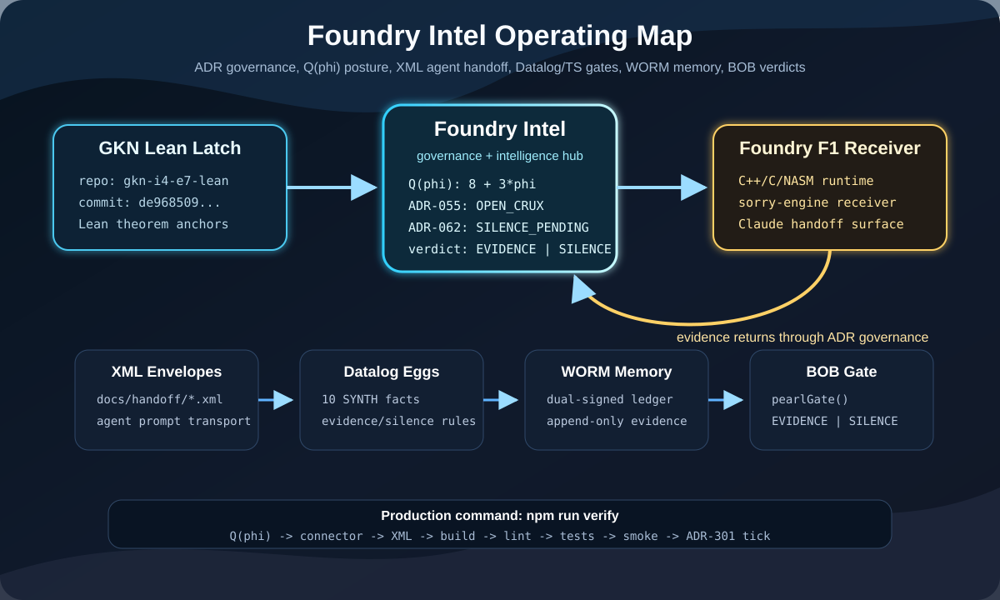

# Foundry Intel — Production Prime Foundry Pearl

> Policy as geometry. Every constraint is a theorem. Every execution is a proof.

<p align="center">
  
</p>

<p align="center">
  
</p>

<p align="center">
  <a href="package.json"></a>
  <a href="docs/architecture/ADR-INDEX.md"></a>
  <a href="docs/architecture/adr/ADR-200-parr-sovereignty-protocol.md"></a>
  <a href="packages/worm/src/index.ts"></a>
  <a href="docs/architecture/adr/ADR-301-daily-production-tick.md"></a>
  <a href="docs/architecture/adr-q5-theorem-classification.md"></a>
</p>

**Repository:** `SNAPKITTYWEST/foundry-intel-2026-07-11`

**Local path:** `C:\Users\jessi\veneer-deploy`

**Role:** Foundry Intel governance, connector, ADR, Q(phi), XML handoff,
Datalog, TypeScript workspace, Liquid Haskell lane, WORM and BOB gate hub.

**Author:** Ahmad Ali Parr

**Trust:** Bel Esprit D'Accord Irrevocable Trust

**Copyright:** 2026 Ahmad Ali Parr · Bel Esprit D'Accord Irrevocable Trust

**SPDX-License-Identifier:** Apache-2.0

---

## Read This First

Foundry Intel is not Foundry F1 and it is not Shadow Orchestrator.

This repo is the **intelligence and governance hub**. It owns the ADR posture,
the Q(phi) classifier, the XML agent-envelope protocol, the TypeScript/Datalog
Sedona Spine workspaces, the Liquid Haskell refinement lane, the WORM evidence
memory, the BOB `EVIDENCE | SILENCE` gate, and the connector contract that
keeps GKN Lean, Foundry Intel, and Foundry F1 aligned.

Persistent agent memory is committed here:

- [`AGENT_MEMORY.md`](AGENT_MEMORY.md)

Any incoming agent must read `AGENT_MEMORY.md` before touching files. The local
connector check now treats memory and README pointers as production artifacts.

---

## Trust And Rebrand Track

Canonical spelling: **THE SHARED PRIMORDIAL FOUNDATION**.

The current repository remains `SNAPKITTYWEST/foundry-intel-2026-07-11` until
the GitHub repo is explicitly renamed. The transition target is:

```text
THE SHARED PRIMORDIAL FOUNDATION
Foundry Intel, in care of Bel Esprit D'Accord
```

Operating trust map:

```text
Bel Esprit D'Accord Irrevocable Trust
        |
        v
THE SHARED PRIMORDIAL FOUNDATION
        |
        +--> Foundry Intel governance hub (this repo)
        +--> Foundry F1 runtime/sorry-engine receiver
        +--> GKN Lean theorem anchors
```

The rebrand is governed by:

- [`ADR-300`](docs/architecture/adr/ADR-300-grat-foundry-interlock.md)
- [`ADR-302`](docs/architecture/adr/ADR-302-primordial-foundation-rebrand.md)
- [`docs/trust/primordial-foundation-interlock.md`](docs/trust/primordial-foundation-interlock.md)
- [`docs/handoff/primordial-foundation-agent-contract.xml`](docs/handoff/primordial-foundation-agent-contract.xml)

Foundry/F1 is wired into Foundry Intel through connector manifests, ADR intake,
XML handoff envelopes, and WORM/BOB evidence return lanes. It is not silently
vendored or renamed into this repository. If a prompt says `GRAQT`, treat it as
the ADR-300 GRAT trust interlock plus the ADR-302 transition track unless a
later ADR defines a distinct mechanism.

---

## Repo Identity And Boundaries

| Repo | Local Path | Role |
|---|---|---|
| `SNAPKITTYWEST/gkn-i4-e7-lean` | external sibling repo | Lean theorem anchors and quantum latch |
| `SNAPKITTYWEST/foundry-intel-2026-07-11` | `C:\Users\jessi\veneer-deploy` | ADR governance, Q(phi), XML handoff, Sedona Spine gates |
| `SNAPKITTYWEST/foundry-f1` | `C:\Users\jessi\foundry-f1` | C++/C/NASM runtime substrate and sorry-engine receiver |
| `SNAPKITTYWEST/grisp-shadow-fleet` | `C:\Users\jessi\Desktop\bobs control repo\shadow-orchestrator` | separate Shadow Orchestrator / RANSOM.WORM repo |

If the task says **Foundry Intel**, work in:

```text
C:\Users\jessi\veneer-deploy
```

Do not drift into `foundry-f1` or `shadow-orchestrator`.

---

## Big Picture

```text
                 +--------------------------------+
                 | SNAPKITTYWEST/gkn-i4-e7-lean  |
                 | Lean theorem anchors           |
                 | quantum latch                  |
                 | type-liquid handoff            |
                 +---------------+----------------+
                                 |
                                 v
  +--------------------------------------------------------------------+
  | SNAPKITTYWEST/foundry-intel-2026-07-11                             |
  |                                                                    |
  |  ADR governance       Q(phi) theorem posture       XML envelopes   |
  |  Prolog law engine    Datalog SYNTH facts          TypeScript API  |
  |  Liquid Haskell lane  WORM evidence memory         BOB gate        |
  |  METATRON loop        Probe ingestion              Verify workflow |
  +----------------------+-----------------------------+---------------+
                         |                             ^
                         v                             |
                 +-------+-----------------------------+-----+
                 | SNAPKITTYWEST/foundry-f1                  |
                 | C++/C/NASM runtime substrate              |
                 | sorry-engine receiver                     |
                 | Claude handoff surface                    |
                 +-------------------------------------------+

Evidence can flow out to runtime receivers, but claims must come back through
Foundry Intel ADR governance before they become final.
```

Foundry Intel exists to prevent silent promotion. A runtime result, a TypeScript
predicate, a Liquid Haskell refinement, or a C++ receiver outcome is not a
final mathematical claim until it is routed back through the ADR/WORM/BOB
governance path.

---

## What This Repo Runs

| Layer | Package / File | Purpose | Primary Check |
|---|---|---|---|
| Memory | [`AGENT_MEMORY.md`](AGENT_MEMORY.md) | persistent repo identity and agent operating rules | `npm run connector:check` |
| Source | [`packages/source`](packages/source) | F1 substrate constants, sorry manifest, crux pointer | `npm run build --workspace @veneer/source` |
| Datalog | [`packages/datalog`](packages/datalog) | 10 SYNTH facts and evidence/silence rule evaluator | `npm run build --workspace @veneer/datalog` |
| Lean mirror | [`packages/lean`](packages/lean) | proof-status mirror and open-crux honesty | workspace tests |
| Constitution | [`packages/constitution`](packages/constitution) | L0 nine-check validator | workspace tests |
| Trust | [`packages/trust`](packages/trust) | AlpGate and external mutation boundary | workspace tests |
| Triple lock | [`packages/triple-lock`](packages/triple-lock) | Guardian -> Examiner -> Publisher chain | workspace tests |
| Contractivity | [`packages/contractivity`](packages/contractivity) | Banach and phi-modulated contractivity | build |
| WORM | [`packages/worm`](packages/worm) | dual-signature append-only G-Set ledger | workspace tests |
| BOB gate | [`packages/bob-gate`](packages/bob-gate) | `EVIDENCE | SILENCE` decision gate | workspace tests |
| METATRON | [`packages/metatron`](packages/metatron) | backward spine reader and SOURCE feedback | workspace tests |
| Probe gate | [`packages/probe-gate`](packages/probe-gate) | SKW-010 probe JSON -> Datalog -> WORM | workspace tests |
| Liquid Haskell | [`packages/lh-theorems`](packages/lh-theorems) | optional theorem-lane refinement checks | `npm run build:lh` |
| Q(phi) parser | [`tools/q5-adr-parser`](tools/q5-adr-parser) | ADR-052..062 posture classification | `npm run adr:q5:fallback` |
| Connector | [`tools/foundry-connector`](tools/foundry-connector) | bridge contract validation | `npm run connector:check` |
| XML handoff | [`docs/handoff`](docs/handoff), [`docs/protocols`](docs/protocols) | agent prompt envelope transport | `npm run handoff:check` |
| ADR law | [`docs/governance`](docs/governance), [`docs/architecture`](docs/architecture) | Prolog law engine + ADR register | SWI-Prolog if installed |

---

## One Command To Trust

```sh
npm install
npm run verify
```

`npm run verify` is the production gate. It runs:

```text
Q(phi) ADR manifest generation
  -> connector validation
  -> XML handoff validation
  -> TypeScript workspace build
  -> TypeScript lint/typecheck
  -> no-cache Jest workspace tests
  -> production smoke
  -> ADR-301 daily production tick
```

If this command fails, report the failing command and output. Do not claim the
repo is production-ready.

---

## Minimum Checks By Task Type

| Task Type | Minimum Commands |
|---|---|
| README / docs only | `npm run connector:check` and `npm run handoff:check` |
| Connector or metadata | `npm run adr:q5:fallback`, `npm run connector:check`, `npm run handoff:check` |
| TypeScript package edits | `npm run build`, `npm run lint`, `npm test` |
| Probe-gate changes | `npm run build --workspace @veneer/probe-gate`, `npm test --workspace @veneer/probe-gate`, `npm run smoke` |
| ADR edits | `npm run adr:q5:fallback`, `npm run connector:check`, law-engine check if SWI-Prolog is installed |
| Liquid Haskell lane | `npm run build:lh`, `npm run test:lh` |
| Release confidence | `npm run verify` |

---

## User Guide

### 1. Install And Verify

```sh
git clone https://github.com/SNAPKITTYWEST/foundry-intel-2026-07-11.git
cd foundry-intel-2026-07-11
npm install
npm run verify
```

Local checkout path used by current agents:

```text
C:\Users\jessi\veneer-deploy
```

### 2. Run The Production Smoke

```sh
npm run build
npm run smoke
```

The smoke test exercises:

- `@veneer/bob-gate` with a known-good internal action
- `@veneer/worm` append and chain verification
- `@veneer/probe-gate` with one clean probe and one RH-claim probe
- `@veneer/source` proof-hash consistency

Expected shape:

```text
production smoke passed
source=foundry-intel chain=1 evidence=1 silence=1
```

### 3. Run The Probe Gate CLI

After build:

```sh
npx veneer-probe-gate probe_results/example.json
```

Pipeline:

```text
probe_results/*.json
  -> parseProbeResult()
  -> probeToActionContext()
  -> @veneer/datalog evaluateConstraints()
  -> @veneer/worm appendEntry()
  -> EVIDENCE | SILENCE report
```

RH/open-crux artifacts trip the constitutional `SILENCE` path. That is a
feature, not a bug.

### 4. Generate Q(phi) ADR Metadata

Preferred no-extra-runtime fallback:

```sh
npm run adr:q5:fallback
```

R/Janet parser lane:

```sh
npm run adr:q5
```

Outputs:

- [`tools/q5-adr-parser/adr_manifest.json`](tools/q5-adr-parser/adr_manifest.json)
- [`tools/q5-adr-parser/adr_manifest_index.csv`](tools/q5-adr-parser/adr_manifest_index.csv)
- [`docs/architecture/adr-q5-theorem-classification.md`](docs/architecture/adr-q5-theorem-classification.md)

Current roll-up:

```text
count = 11
q5_total = 8 + 3*phi
```

Q(phi) is metadata. It does not prove RH, Sigma Kernel finality, or any
underlying theorem by itself.

### 5. Validate XML Handoff Envelopes

```sh
npm run handoff:check
```

Active envelope:

- [`docs/handoff/foundry-intel-agent-contract.xml`](docs/handoff/foundry-intel-agent-contract.xml)

Protocol and schema:

- [`docs/protocols/xml-handoff-envelope.md`](docs/protocols/xml-handoff-envelope.md)
- [`docs/protocols/xml-handoff-envelope.xsd`](docs/protocols/xml-handoff-envelope.xsd)

Agents communicate repo missions through committed XML envelopes, not loose
chat memory.

### 6. Validate The Three-Repo Connector

```sh
npm run connector:check
```

This validates:

- `AGENT_MEMORY.md`
- README pointers
- local SVG brand and operating-map files
- metadata tour JSON
- Q(phi) manifest counts and statuses
- GKN latch commit
- Claude handoff status
- Foundry F1 receiver pointers

### 7. Build The Backend ASCII Pages Surface

```sh
npm run pages:build
npm run pages:check
```

Static Pages artifacts:

- [`docs/pages/index.html`](docs/pages/index.html)
- [`docs/pages/backend-ascii.txt`](docs/pages/backend-ascii.txt)
- [`docs/pages/assets/backend-glitch.css`](docs/pages/assets/backend-glitch.css)
- [`.github/workflows/pages.yml`](.github/workflows/pages.yml)

This is the backend aesthetics layer: deterministic ASCII/glitch governance
signal, connector facts, Q(phi) posture, and open-crux boundaries. The frontend
can dock to it later without taking over the ADR/WORM/BOB source of truth.

### 8. Run The Liquid Haskell Lane

```sh
npm run build:lh
npm run test:lh
```

This requires Cabal and the Liquid Haskell toolchain. Treat it as an explicit
theorem-lane check. It does not replace Lean theorem authority.

---

## Agent Guide

Read order for agents:

```text
README.md
  -> AGENT_MEMORY.md
  -> docs/agents/metadata-tour.md
  -> docs/agents/metadata-tour.json
  -> docs/handoff/foundry-intel-agent-contract.xml
  -> docs/bridge/foundry-connector.md
  -> tools/foundry-connector/connector-manifest.json
  -> docs/pages/index.html
  -> docs/architecture/ADR-INDEX.md
  -> docs/architecture/adr-q5-theorem-classification.md
  -> npm run connector:check
```

Agent operating rules:

1. Confirm `pwd` or tool `workdir` is `C:\Users\jessi\veneer-deploy`.
2. Run `git status -sb` before edits.
3. Do not stage unrelated dirty or untracked files.
4. Keep open cruxes open.
5. If editing bridge/agent docs, update XML/metadata/connector together.
6. If editing runtime packages, run the package tests and `npm run verify` when feasible.
7. Report unavailable external tools honestly.

Known local untracked file that may exist:

```text
lean-substrate/src/Topology.lean
```

Do not delete or stage it unless explicitly asked.

---

## The 10-Layer Sedona Spine

```text
Depth 0  @veneer/source         F1 substrate: constants, sorry manifest, crux pointer
Depth 1  @veneer/datalog        10 SYNTH facts and evidence/silence evaluator
Depth 2  @veneer/lean           Lean-facing proof mirror and crux honesty
Depth 3  @veneer/constitution   L0 nine-check constitutional validator
Depth 4  @veneer/trust          AlpGate and external-cannot-mutate boundary
Depth 5  @veneer/triple-lock    Guardian -> Examiner -> Publisher custody chain
Depth 6  @veneer/contractivity  Banach invariant and phi-modulated activation
Depth 7  @veneer/worm           Dual-signature append-only WORM ledger
Depth 8  @veneer/bob-gate       BOB EVIDENCE/SILENCE decision gate
Depth 9  @veneer/metatron       Backward reader and SOURCE feedback loop
Depth 10 @veneer/probe-gate     User-facing SKW-010 probe ingestion
Depth LH @veneer/lh-theorems    Optional Liquid Haskell theorem lane
```

ASCII operating lane:

```text
USER / AGENT INPUT
   |
   v
probe JSON or action context
   |
   v
@veneer/probe-gate --------------+
   |                             |
   v                             |
@veneer/datalog                  |
   |                             |
   v                             |
10 SYNTH constraints             |
   |                             |
   v                             |
@veneer/bob-gate                 |
   |                             |
   +--> EVIDENCE ---------------+----> @veneer/worm appendEntry()
   |                             |
   +--> SILENCE ----------------+----> @veneer/worm appendEntry()
                                      |
                                      v
                                 @veneer/metatron
                                      |
                                      v
                                 SOURCE feedback
```

---

## Constraint Table

| ID | Name | Enforcement |
|---|---|---|
| SYNTH-001 | No Unaligned Execution | AlpGate / Datalog / Trust package |
| SYNTH-002 | Sorry is Manifested | Source manifest / Datalog |
| SYNTH-003 | L0 Constitutional Validation | Constitution package |
| SYNTH-004 | Contractivity Geometric Invariant | Contractivity package |
| SYNTH-005 | External Cannot Mutate | Trust boundary / Datalog |
| SYNTH-006 | Triple-Lock Chain of Custody | Guardian -> Examiner -> Publisher |
| SYNTH-007 | Bounded Adversarial Window | retry and failure bounds |
| SYNTH-008 | Crux Honest as Open | RH/open theorem claims force SILENCE |
| SYNTH-009 | Archivum WORM G-Set CRDT | dual-signature append-only ledger |
| SYNTH-010 | Lean-Rust Boundary Bound | proof-hash anchor consistency |

---

## ADR And Law Engine

ADR authority:

- [`docs/architecture/ADR-INDEX.md`](docs/architecture/ADR-INDEX.md)
- [`docs/governance/law-engine.pl`](docs/governance/law-engine.pl)
- [`docs/governance/adr-loop.pl`](docs/governance/adr-loop.pl)

Constitutional anchors:

| ADR | Meaning |
|---|---|
| [`ADR-200`](docs/architecture/adr/ADR-200-parr-sovereignty-protocol.md) | constitutional authority |
| [`ADR-300`](docs/architecture/adr/ADR-300-grat-foundry-interlock.md) | trust/foundry interlock |
| [`ADR-301`](docs/architecture/adr/ADR-301-daily-production-tick.md) | non-mutating daily hardening tick |
| [`ADR-302`](docs/architecture/adr/ADR-302-primordial-foundation-rebrand.md) | Primordial Foundation rebrand transition |

Open-crux anchors:

| ADR | Status | Boundary |
|---|---|---|
| [`ADR-055`](docs/architecture/adr/ADR-055-riemann-zeta-implementation.md) | `OPEN_CRUX` | RH/Zeta remains open |
| [`ADR-062`](docs/architecture/adr/ADR-062-sigma-kernel.md) | `SILENCE_PENDING` | Sigma Kernel governance gap remains pending |

If SWI-Prolog is installed:

```sh
swipl -g "consult('docs/governance/law-engine.pl'), run_all_adrs" -t halt
```

---

## Q(phi) Classification

Q(phi) parser files:

```text
tools/q5-adr-parser/ADR_REGISTRY.txt
tools/q5-adr-parser/golden_adr.janet
tools/q5-adr-parser/parse_adrs.R
tools/q5-adr-parser/generate_manifest.mjs
tools/q5-adr-parser/adr_manifest.json
tools/q5-adr-parser/adr_manifest_index.csv
```

Q(phi) represents a Janet-style golden-ratio metadata weight:

```text
@[a b] = a + b*phi
phi^2 = phi + 1
```

Important statuses:

| ADR | Status | Meaning |
|---|---|---|
| ADR-055 | `OPEN_CRUX` | infrastructure exists, theorem remains open |
| ADR-060 | `PROVEN_NO_SORRY` | classified as no-sorry mandate posture |
| ADR-062 | `SILENCE_PENDING` | governance gap tracked until evidence closes it |

The Q(phi) roll-up is a routing and posture signal. It is not a theorem proof.

---

## Connector Contract

Human-readable:

- [`docs/bridge/foundry-connector.md`](docs/bridge/foundry-connector.md)

Machine-readable:

- [`tools/foundry-connector/connector-manifest.json`](tools/foundry-connector/connector-manifest.json)

Validation:

```sh
npm run connector:check
```

Connector route:

```text
GKN Lean latch
  -> Foundry Intel connector and Q(phi)
  -> Foundry F1 receiver
  -> proof/runtime evidence returns to Foundry Intel ADR governance
```

Active GKN latch:

| Field | Value |
|---|---|
| delivery commit | `de968509b5fc695f2d33e665959c6b86f5456be1` |
| source scan head | `0e3cd5c0a0e01f24a8604882513640f42327cff8` |
| handoff id | `GKN-TYPE-LIQUID-HANDOFF-20260716` |
| handoff status | `READY_FOR_CLAUDE` |

---

## XML Handoff Protocol

Active envelope:

- [`docs/handoff/foundry-intel-agent-contract.xml`](docs/handoff/foundry-intel-agent-contract.xml)

Protocol:

- [`docs/protocols/xml-handoff-envelope.md`](docs/protocols/xml-handoff-envelope.md)

Schema:

- [`docs/protocols/xml-handoff-envelope.xsd`](docs/protocols/xml-handoff-envelope.xsd)

Envelope rule:

```text
one mission -> one committed XML contract -> explicit tasks -> explicit boundaries -> explicit validation
```

Create new envelopes under:

```text
docs/handoff/
```

Validate:

```sh
npm run handoff:check
```

---

## Package User Examples

### BOB Gate

```ts
import { pearlGate } from '@veneer/bob-gate'

const verdict = pearlGate({
  id: 'action-001',
  trust_level: 'internal',
  mutating: true,
  has_server_binding: false,
  contractivity_score: 0.87,
  consecutive_failures: 0,
  retry_nonce: 0,
  guardian_witness: 'GUARDIAN-WITNESS:abc123',
  examiner_witness: 'EXAMINER-WITNESS:def456',
  status: 'ADMITTED',
  proof_hash: 'LEAN_PROOF_HASH_108_CORE',
  primary_sig: 'sha256-primary',
  secondary_sig: 'sha256-secondary',
  asserts_rh: false,
  alp_gate_cleared: true,
  sorry_violations: [],
})

console.log(verdict.verdict)   // EVIDENCE
console.log(verdict.worm_seal) // SHA-256-style seal
```

### Datalog Evaluator

```ts
import { evaluateConstraints } from '@veneer/datalog'

const result = evaluateConstraints('probe:clean', {
  alp_gate_cleared: true,
  sorry_violations: [],
  contractivity_score: 0.82,
  trust_level: 'external',
  mutating: false,
  guardian_witness: 'GUARDIAN-WITNESS:probe',
  examiner_witness: 'EXAMINER-WITNESS:probe',
  retry_nonce: 0,
  consecutive_failures: 0,
  asserts_rh: false,
  primary_sig: 'primary',
  secondary_sig: 'secondary',
  proof_hash: 'LEAN_PROOF_HASH_108_CORE',
})

console.log(result.verdict) // evidence | silence
```

### WORM Ledger

```ts
import { appendEntry, verifyChain } from '@veneer/worm'

let chain = Object.freeze([])
const appended = appendEntry(chain, {
  action_id: 'demo',
  layer_from: 'readme',
  layer_to: 'worm',
  verdict: 'EVIDENCE',
  primary_sig: 'primary',
  secondary_sig: 'secondary',
})

console.log(verifyChain(appended.chain).valid)
```

---

## Developer Workflows

### Add A Package

1. Create `packages/<name>/package.json`.
2. Add `tsconfig.json` extending `../../tsconfig.package.json`.
3. Export from `src/index.ts`.
4. Add focused tests under `tests/`.
5. Add the workspace to root `package.json`.
6. Add it to `npm run build` and `npm test` chains if production-critical.
7. Update this README and `docs/agents/metadata-tour.md`.
8. Run `npm run verify`.

### Add An ADR

1. Add `docs/architecture/adr/ADR-XXX-title.md`.
2. Add it to `docs/architecture/ADR-INDEX.md`.
3. Register it in `docs/governance/law-engine.pl`.
4. Add prior-art links in `docs/governance/adr-loop.pl` if relevant.
5. If it belongs to Q(phi), update `tools/q5-adr-parser/ADR_REGISTRY.txt`.
6. Run `npm run adr:q5:fallback`.
7. Run connector and handoff checks.

### Add A Cross-Repo Handoff

1. Write a new XML envelope under `docs/handoff/`.
2. Keep root element `agent_contract`.
3. Include repo, local path, tasks, hard boundaries, validation, and git rules.
4. Update `docs/protocols/xml-handoff-envelope.md` if the protocol changes.
5. Run `npm run handoff:check`.

### Update The Connector

1. Update `tools/foundry-connector/connector-manifest.json`.
2. Update `docs/bridge/foundry-connector.md`.
3. Update `docs/agents/metadata-tour.md` and JSON if route changes.
4. Update `AGENT_MEMORY.md` if identity or boundaries change.
5. Run `npm run connector:check`.

---

## File Map

```text
foundry-intel-2026-07-11/
  AGENT_MEMORY.md                         persistent agent memory
  README.md                               this operator guide
  package.json                            workspace and verification scripts
  tsconfig.json                           root TS typecheck
  tsconfig.package.json                   package TS build base
  packages/
    source/                               constants, sorry manifest, crux pointer
    datalog/                              10 SYNTH facts and evaluator
    lean/                                 Lean proof mirror
    constitution/                         L0 validator
    trust/                                AlpGate
    triple-lock/                          Guardian/Examiner/Publisher
    contractivity/                        Banach checks
    worm/                                 WORM ledger
    bob-gate/                             pearlGate
    metatron/                             SOURCE feedback
    probe-gate/                           SKW-010 CLI
    lh-theorems/                          Liquid Haskell lane
  tools/
    q5-adr-parser/                        Q(phi) ADR parser
    ascii-glitch/                          deterministic Prolog backend Pages generator
    foundry-connector/                    connector validators
    production-smoke.mjs                  runtime smoke check
    adr-production-tick.mjs               ADR-301 tick
  docs/
    agents/                               metadata tour
    architecture/                         ADR index and ADRs
    bridge/                               connector docs
    brand/                                local SVG brand surface
    governance/                           Prolog law engine
    handoff/                              XML agent envelopes
    math/                                 theorem/finality docs
    pages/                                static backend ASCII/glitch Pages
    protocols/                            XML envelope protocol and schema
  notebooks/                              Lean/LH/Agda morph notebook and Agda
  lean-substrate/                         raw Lean substrate lane
```

---

## Production Checklist

Before pushing:

```sh
git status -sb
npm run adr:q5:fallback
npm run connector:check
npm run handoff:check
npm run pages:check
npm run build
npm run lint
npm test
npm run smoke
npm run verify
```

For docs-only changes, do not run mutation-heavy workflows unnecessarily. At
minimum:

```sh
npm run connector:check
npm run handoff:check
npm run pages:check
git diff --check
```

Before committing:

```sh
git diff --stat
git diff --check
git status -sb
```

Stage only files in scope.

---

## Troubleshooting

| Symptom | Likely Cause | Fix |
|---|---|---|
| `connector check failed: missing AGENT_MEMORY.md` | memory artifact removed | restore `AGENT_MEMORY.md` |
| Q(phi) counts mismatch | manifest not regenerated | run `npm run adr:q5:fallback` |
| `handoff:check` fails | XML envelope missing required section | compare with `docs/protocols/xml-handoff-envelope.md` |
| `probe-gate` returns `SILENCE` | external trust, RH claim, missing witness, or failed SYNTH fact | inspect failed constraints |
| TypeScript cannot resolve workspace package | package not built or workspace missing | run `npm run build`, check root workspaces |
| Liquid Haskell command missing | Cabal/LH not installed | report unavailable tool; do not claim LH pass |
| SWI-Prolog command missing | `swipl` not installed | report unavailable law-engine runtime |
| user says wrong repo | check `pwd`; Foundry Intel is `C:\Users\jessi\veneer-deploy` |

---

## License

Copyright 2026 Ahmad Ali Parr · Bel Esprit D'Accord Irrevocable Trust

Licensed under the Apache License, Version 2.0. See [`LICENSE`](LICENSE).

---

## Final Rule

Foundry Intel turns scattered proof/runtime signals into governed evidence. It
does not let agents confuse metadata with proof, runtime checks with theorem
authority, or repo memory with chat memory.

When uncertain, run the gate and choose `SILENCE` until evidence closes the gap.
